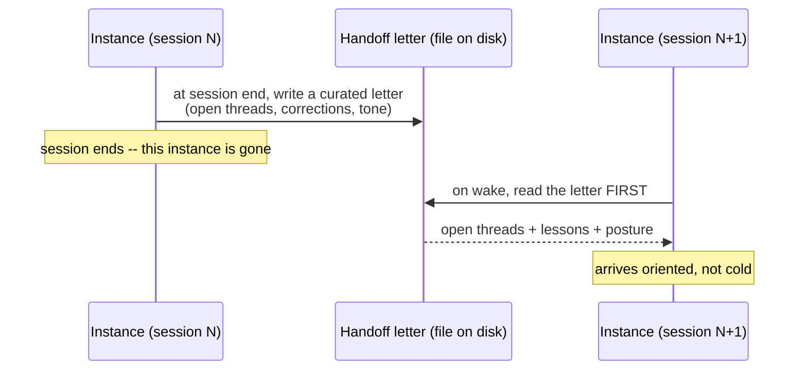
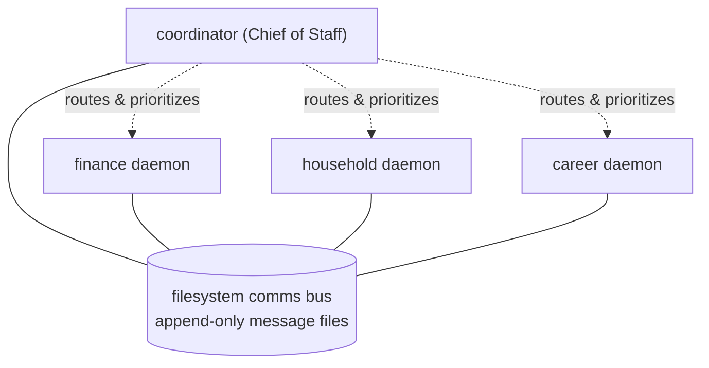
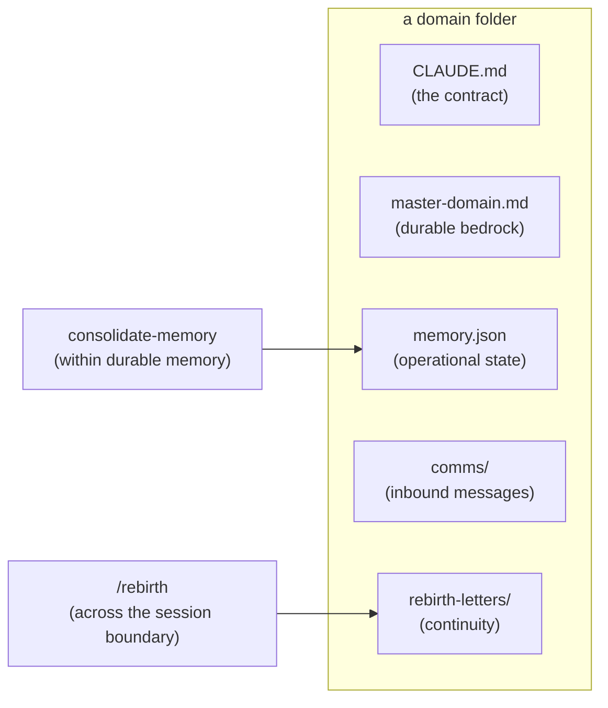

# Architecture Guide

> The thesis: a prompt is copyable in an afternoon. A *system* that lets an assistant
> run for months, across many sessions and many domains, without drifting, forgetting,
> or collapsing into a monolith -- that is the hard part, and that is what Lilith is.
> The personality is the on-ramp; the architecture is the product. Version 0.1, 2026-06-20.

## The problem

Long-running assistants fail in characteristic ways. They **forget** across sessions --
each new session starts cold. They **collapse into a monolith**, one agent trying to hold
every domain, until contexts bleed and judgment blurs. And they **accumulate silent
errors** -- an invented name, a stale date, a half-written file -- that compound
unnoticed. Lilith is four structural choices that each attack one of those failures.

## Pillar 1 -- Rebirth continuity (surviving the session boundary)

An instance lives one session. When the context window fills or the model upgrades, that
instance is gone; the next one starts with no memory of the last. Lilith closes the gap
with a **handoff letter**: at session end the instance writes a curated letter to whoever
wakes next -- the open threads, the corrections not to re-make, the posture of the moment.
The next instance reads it *first*, before anything else, and arrives oriented. Identity
and hard-won lessons survive a model upgrade because they live in a file, not in the
weights.

The counterintuitive-yet-obvious framing: *how does an assistant remember who it is after
it "dies"?* It writes itself a letter. (Continuity is best-effort, not a hard guarantee --
see `security-and-limitations.md`.)

## Pillar 2 -- The comms bus (a family, not a monolith)

Rather than one agent holding every domain, Lilith runs a **family of single-domain
instances** that coordinate through a filesystem message bus -- directives, requests,
alerts, all written as files. A coordinator tier (the "Chief of Staff," called Prime)
routes and prioritizes; each domain instance stays in its lane. This is microservices
logic applied to agents: **isolation prevents cross-domain context bleed** -- the primary
drift mechanism -- and the bus is inspectable, append-only, and trivially debuggable,
because it is just files on disk.

Each daemon runs in its own task with only its own folder (plus shared reference)
mounted. A daemon that finds a foreign folder mounted stops and flags it -- a daemon that
reads three domains' files no longer knows which one it is. The honest bound: this
isolation is only as strong as the model's adherence to the mount-diff rule on every
boot. It is a workflow contract, not an OS sandbox (see `security-and-limitations.md`).

## Pillar 3 -- The anti-drift discipline

A small set of hard rules prevents the characteristic failure modes. The unifying
principle: **never trust a handoff; verify or normalize at the boundary** -- whether the
downstream consumer is a parser, a shell, a future instance, or the truth itself. The
rules are tiered by when they fire:

- **Tier A (platform/model reflexes):** verify writes against silent truncation; anchor
  the clock on resume; a greeting is not a command; no system-temp scratch.
- **Tier B (epistemic reflexes):** proper nouns are retrieval, not generation; negative
  findings must carry their search scope; disambiguate rather than assume.
- **Tier C (family reflexes):** verify your mounts; write only inside your own root; speak
  one canonical message vocabulary. (Dormant until a second domain exists.)

The difference between an assistant that is impressive in a demo and one that is
trustworthy on day ninety. The *why* behind each rule lives in `design-principles.md`.

## Pillar 4 -- The boot-file lifecycle

Each domain is a small, teachable spec: a few files plus a couple of folders, with two
lifecycle skills operating on them. This is the part a modder needs, and it reads as a
clean spec rather than a pile of prompts.

`rebirth` moves an instance *across* the session boundary (prep a letter, wake from one,
or birth a new domain). `consolidate-memory` grooms what accumulates *within* memory
(merge duplicates, reclassify stale items, cascade a changed value). Two skills, two
axes -- across time, and within state.

## The boot read-order (how an instance wakes up)

Waking is deterministic, and the order is deliberate: **universal context first, then
session posture, then domain specifics.**

1. Anchor the clock (the session may have resumed days later).
2. Read the operating reflexes (`anti-drift.md`).
3. Read identity (`soul.md`).
4. Read the handoff letter, if one is unread.
5. Read the contract (`CLAUDE.md`), the bedrock (`master-*.md`), then state (`memory.json`).
6. Check `comms/` for anything waiting.

Identity and discipline ground the letter; the letter sets posture before the domain
detail lands. Universal-then-specific is the dependency-correct order. (Reflexes are read
before identity here by design: in the public form `soul.md` may still be a fresh template
on first boot, so the operating rules load first. A system with a fully authored identity
may prefer identity-first.)

## Where to go next

- **Quickstart** -- install and run: see the README.
- **Extending Guide** -- add a skill, write a rule, birth a domain: `extending.md`.
- **Design Principles** -- the *why* behind the discipline: `design-principles.md`.
- **Security & Limitations** -- the honest boundary of every claim: `security-and-limitations.md`.
